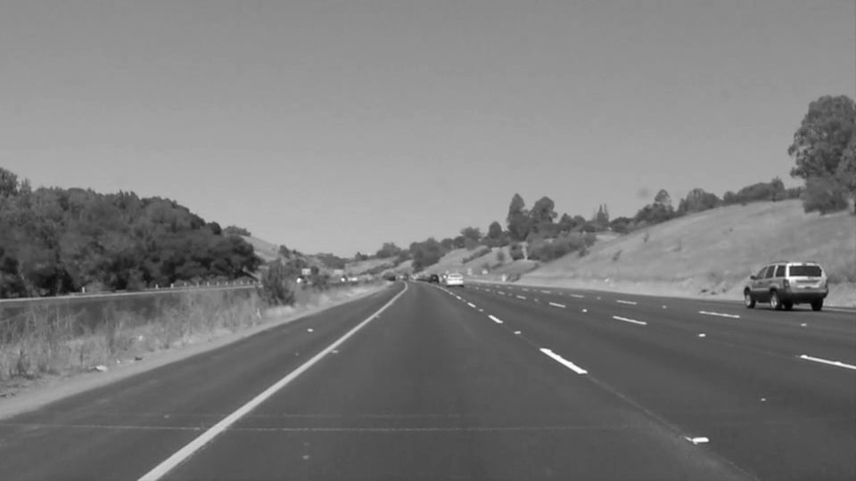
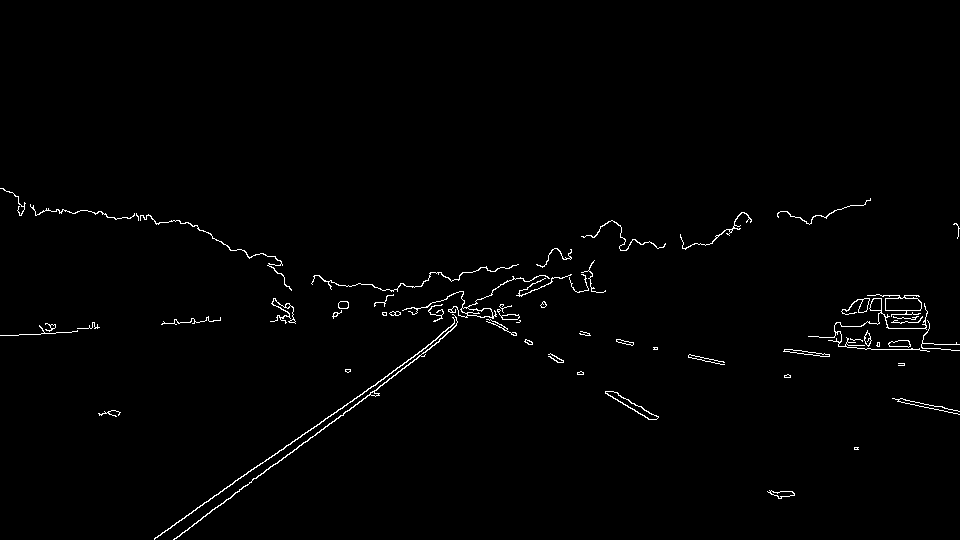
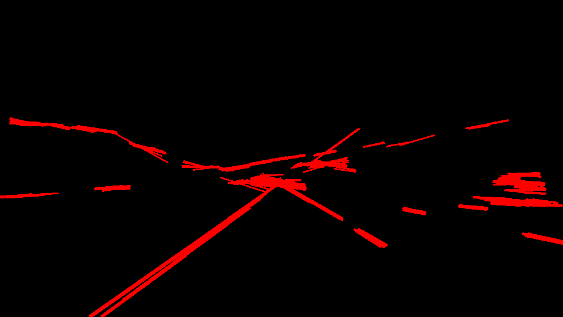

# Finding Lane Lines on the Road

The goal of this project is to use computer vision techniques to locate the bounding lane markers on a road.

### Reflection

#### Image processing pipeline

Images and videos were provided with sample driving scenes from the motorist's perspective. Each image or frame of a video runs through a sequential series of transformations to emphasize objects of interest. In this case, the objects of interest are markings on the road that show the closest lane lines on either side of the imaginary center line of the scene (lane boundaries). After producing representations of the lane lines (straight lines of pixels), combine those lines to calculate up to two lines representing the right and left lane lines.

##### Transformation pipeline

Each step in the pipeline is described below to process a given image, the output from the previous step is fed into the input of the next step. Example image:

---

---

1. Grayscale

    An image is represented as a 2-D array of pixel values. Each pixel value is represented by the RGB color model, three channels/dimensions of red, green and blue intensities. This step transforms RGB into a grayscale color model with only one channel, (or one dimension) with values ranging from 0-255 degrees of white color intensity. This is a useful/required format for further processing.

---

---

2. Apply a region of interest (roi) mask

    Reduce the image area and noise for further processing by masking all pixels not within an roi boundary (rectangle). All pixels outside the roi are set to 0 (black).

3. Canny edge detection

    Apply the opencv Canny edge detection algorithm to outline objects and shapes in the region of interest. The algorithm will calculate changes of intensity from pixel to pixel (gradient) and mask any pixels with gradients below a give threshold.

---

---

1. Blur

    Exaggerate/amplify and blend the edges found from the previous step to increase their resolution, which otherwise might appear too pixelated.

---

---

1. Hough line detection

    Apply the opencv Hough line detection algorithm to the amplified edges, which should produce sets of lines within the lane markers on the road. Expect longer lines for the solid lane lines and shorter lines for dashed lane lines. Paramemters of the algorithm include the minimum length of a meaningful line (e.g. a line if 2 pixels is useless) and the ability to consider lines with gaps (dashed) as the same solid line.

---

---

##### Lane line calculations

This transformation pipeline will produce a set of lines corresponding to straight edges detected from the image. An assumption is that the lane lines will be represented by a group of these lines clustered together. Further processing reduces the hundreds of lines produced to at most 2 lines representing the right and left lane lines.

1. Extend/project each line to the bottom of the image (y = image_height).
1. Group the lines into range buckets depending on the x-value of where they land at the bottom (clusters). Lines to the right of the imaginary center line of the image must have a positive slope to qualify, lines to the left must have a negative slope.
1. Identify the closest clusters on the right and left sides of the imaginary center line of the image.
1. At this point, there will be two groups of lines, one for each of the right and left lane lines. For each group, calculate the average value of the slope and point of intersection at the bottom of the image. These two lines represent the closest lane lines to the imaginary center of the image.
1. For videos, keep a history of lane line positions and average those positions from frame to frame for smooth evolution of the lane lines throughout the video.

### Limitations

The assumptions used in this processing pipeline introduce a great number of limitations for finding lane lines under natural, uncontrolled road conditions and environments. A few of the more important assumptions:

* Lanes are clearly marked and visible on the road
* Optimal lighting conditions
* Edge detection is used to find the lane lines without regard to color or deeper qualifying features of lane markers. For example, flaws in the middle of the lane of the road could be confused as a lane line with this pipeline (Southbound Route 101 near Palo Alto, CA comes to mind).
* Lane lines slope inward toward the horizon. Entering a steep road looking down might not fit this assumption so nicely (Gough Street in San Francisco comes to mind).
* Lane lines will be represented by a group of Hough lines clustered together
* Lane lines can be distinguished by the computer vision algorithms, and have enough contrast from the road to be detected. This assumption caused problems on one of the examples (challenge) where the color of the road became lighter over a concrete bridge. Shadows, lighting and weather can cause such problems as well.
* Lane lines are straight - curvy roads at high speeds may not give enough signals to expose the lane lines.

### Ideas for further work and improvements

Some ideas to overcome a few of the limitations mentioned previously:

* Use color as part of edge detection
* Allow lane lines to be described by other means than simply groups of straight lines extracted from edge detection. For example, once/if lane lines can be initially established, use frame-to-frame motion detection (MOG, etc) to more accurately evolve the lane direction over time.
* Use more advanced outlier detection algorithms to discard lane lines that are drastically different from one frame to the next
* More precise region of interest selection for image processing to reduce background noise

### Results

* [Processed images](/test_images_output/)
* [Processed videos](/test_videos_output/)

